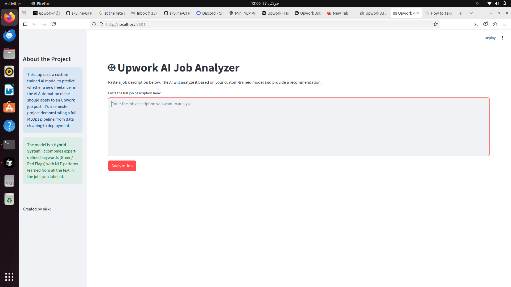

# Upwork Job Analyzer AI 🤖

[](https://choosealicense.com/licenses/mit/)
[](https://www.python.org/downloads/)
[](https://streamlit.io)

An intelligent tool to help new freelancers in the AI Automation niche decide whether to **Apply** or **Skip** an Upwork job post, powered by a custom-trained hybrid NLP model.

---



## 🎯 About The Project

New freelancers on Upwork often waste time and "Connects" applying to jobs they are unlikely to get. This can be due to a mismatch in skills, unrealistic client expectations, or requirements for seasoned experts.

This project solves that problem by providing an AI-powered assistant that analyzes the text of a job description and provides an instant "Apply" or "Skip" recommendation with a confidence score. It was developed as a semester project to demonstrate a complete, end-to-end machine learning workflow.

### ✨ Key Features

-   **Hybrid AI Model:** Utilizes a Logistic Regression classifier that learns from both expert-defined rules (Red/Green Flags) and statistical text patterns discovered via NLP (TF-IDF with n-grams).
-   **Automated Data Cleaning:** A robust pipeline automatically cleans raw job descriptions by removing emojis, URLs, and excess whitespace before analysis.
-   **Interactive Web App:** A clean, minimal, and aesthetic user interface built with Streamlit for easy interaction and analysis.
-   **Reproducible Workflow:** The project is structured with separate scripts for training and inference, making it easy to retrain and improve the model with new data.

### 📈 Model Performance

The current model was trained on a labeled dataset of niche AI automation jobs and achieves a respectable **80% accuracy** on the unseen test set.

Notably, the classification report shows the model has **100% recall for "Skip" jobs**. This means it is highly effective at its primary goal: protecting new freelancers from wasting time on unsuitable opportunities.

### 🛠️ Tech Stack

-   **Python**
-   **Scikit-learn:** For machine learning model training and evaluation.
-   **Pandas:** For data manipulation and cleaning.
-   **Streamlit:** For building the interactive web application.
-   **Joblib:** For saving and loading the trained model.

## 🚀 Getting Started

Follow these steps to set up and run the analyzer on your local machine.

### Prerequisites

-   Python 3.8+
-   `pip` and `venv`

### Installation & Setup

1.  **Clone the Repository**
    ```sh
    git clone https://github.com/[YOUR_USERNAME]/[YOUR_REPO_NAME].git
    cd upwork-job-analyzer
    ```

2.  **Set Up a Virtual Environment (Recommended)**
    ```sh
    python3 -m venv venv
    source venv/bin/activate  # On Windows, use `venv\Scripts\activate`
    ```

3.  **Install Dependencies**
    Install all the required Python libraries from the `requirements.txt` file.
    ```sh
    pip install -r requirements.txt
    ```

4.  **Train the AI Model**
    Before you can run the app, you need to train the model on the provided labeled data. This will generate the `job_classifier_model.pkl` file inside the `src/` folder.
    ```sh
    python src/run_training.py
    ```

5.  **Run the Streamlit App**
    Now you can launch the web application. The `app.py` script will automatically load the model you just trained.
    ```sh
    streamlit run app.py
    ```
    Your web browser will open with the Upwork Job Analyzer, ready to use!

## 📁 Project Structure

The repository is organized to separate data, source code, and the application for clarity and best practices.
```
├── .gitignore # Files to be ignored by Git
├── app.py # The Streamlit web application
├── LICENSE # MIT License file
├── README.md # You are here!
│
├── data/
│ └── hybrid_filtered_jobs.csv # Labeled training data
│
├── Images/
│ ├── preview.png # Screenshot for the README
│ └── Tesr.png
│
└── src/
├── run_training.py # Script to clean data and train the model
└── job_classifier_model.pkl # The trained model (generated by script)
```


## 📄 License

Distributed under the MIT License. See `LICENSE` for more information.

## 👤 Contact

okki - [Link to your GitHub Profile]

---
